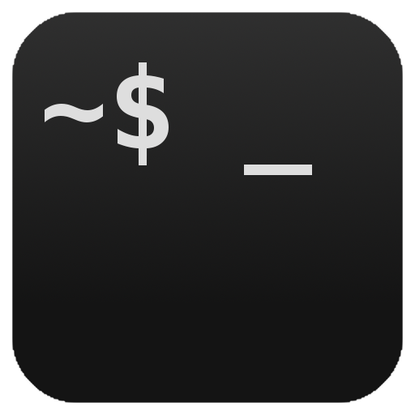
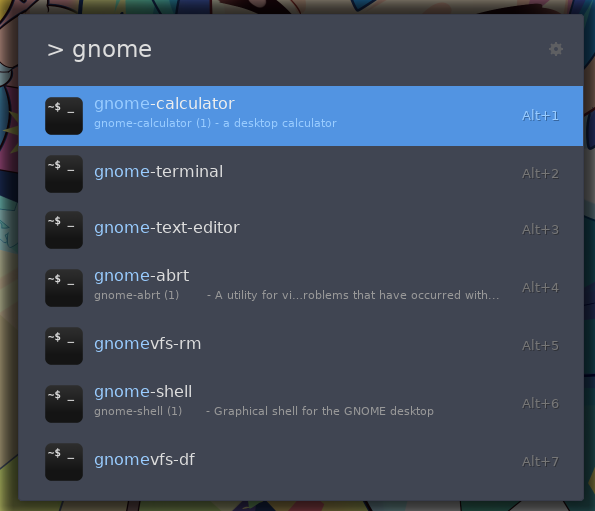
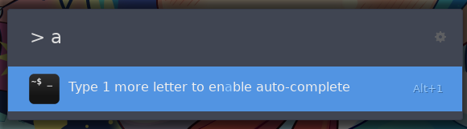

#  Ulauncher-Shell
A [Ulauncher](https://ulauncher.io/) extension to run programs by typing their executable name.

# Features
- Use Bash builtin auto-completion to predict programs
- Use `whatis` to give info about programs

# TO-DO List
- [ ] Configurable minimum word size before enabling auto-complete (currently forced to 2)
- [ ] Adding arguments
- [ ] Launching commands not found in PATH

# Screenshots

# Installing

Open **Settings > Extensions > Add extension**: paste "https://github.com/skielred/Ulauncher-Shell"

# Helping out

Spotted an issue? [Let me now!](https://github.com/skielred/Ulauncher-Shell/issues/new)

Interesting in adding features? [Fork this repository](https://github.com/skielred/Ulauncher-Shell/fork)
then [submit a Pull Request!](https://github.com/skielred/Ulauncher-Shell/compare)

# Disclaimer

Ulauncher is open source and can be found on GitHub @ [Ulauncher/Ulauncher](https://github.com/Ulauncher/Ulauncher/).

Icon from [shareicon.net](https://www.shareicon.net/terminal-94589).
